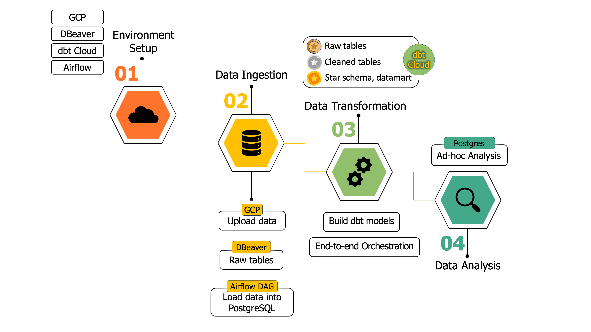

# **ELT Data Pipeline for Airbnb Analytics**
---
## **Introduction**
The goal of this project is to build production-ready ELT data pipeline using Apache Airflow and dbt Cloud, with the primary goal of processing and transforming Airbnb and Census data for Sydney. It aims to load this data into a data warehouse structured using the Medallion architecture (Bronze, Silver, Gold) and to create a data mart for analytical insights. Key aspects of the project include efficient data ingestion using Airflow, managing transformations through dbt Cloud, and designing a star schema to organize data in Postgres. Throughout the process, data is transformed from raw form into cleaned and aggregated tables, enabling detailed analysis and insights into rental trends, host behaviours, and demographic factors. The final data mart serves as the foundation for performing ad-hoc analyses that address business questions. 
 

## **Key objectives**
The main objective of this project is to develop robust ELT data pipelines using Apache Airflow and dbt Cloud to process and transform Airbnb and Census data for Sydney. 
 

## **Project workflow**
 
 

## **Tools and Technologies**
- Google Cloud Platform
- dbt Cloud
- Dbeaver
- Apache Airflow (via Cloud Composer)
- Python
- SQL
 

## **Dataset**
- [12 months of Airbnb listing data for Sydney](https://drive.google.com/file/d/1_AvGzOLrCNCnDJyStSj2XH0bTUtsKgb_/view)
- [Census LGA](https://drive.google.com/file/d/1AbfLWOCgPfAY8bBRX1blZdL0-dO2joXT/view): Table G01 (“Selected Person Characteristics by Sex”) and G02 (“Selected Medians and Averages”) of the General Community Profile Pack from 2016 census at the LGA level
- [NSW_LGA](https://drive.google.com/file/d/1y962EkNhG2nBGiMsV8sYN2BeFsIy6zO5/view): A dataset help you join both datasets based on LGAs code and a mapping between LGAs and suburbs. 
 

## **Challenges and Solutions**

### Database connection issue in DBeaver
- Issue: After changing the physical location while running the project, the IP address used for accessing the PostgreSQL database in Google Cloud Platform no longer matched the IP address authorized in the database settings. This led to a connection error in DBeaver: Connection attempt timed out and FATAL: password authentication failed for user 'postgres'
- Solution: Updated the IP address in the Authorized Networks section of the Google Cloud SQL instance settings to include the new IP address.

### Limited free trial credits on Google Cloud
- Issue: I encountered an issue with the Google Cloud account running out of credits, which halted all services associated with our Google Cloud environment.
- Solution: To address the challenge of running out of credits on Google Cloud, the solution was to create a new Google Cloud account, which avoid charges while continuing the project without interruption.

### Memory overload when loading data in Airflow
- Issue: During the data ingestion process, an issue arose when the Airflow failed to load the listings data to Postgres due to memory overload which exceeded the capacity of system resources.
- Solution: To solve the issue, I implemented upload 12 files single by single, which will avoid load 12 listing files at the same time. 
 

## **References**
  dbt Labs. (n.d.). dbt snapshots. Retrieved October 28, 2024, from https://docs.getdbt.com/docs/build/snapshots
  'dbt Labs. (n.d.). dbt snapshot configurations. Retrieved October 28, 2024, from https://docs.getdbt.com/reference/snapshot-configs

